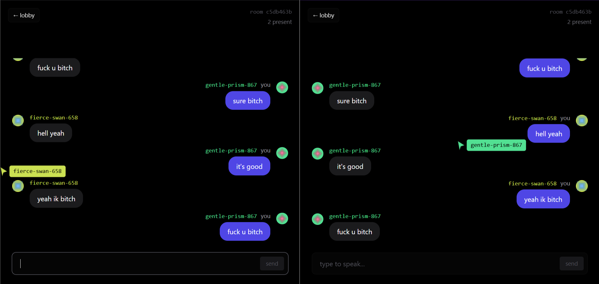

# Ghost Chat
<p align="center">
  
</p>

## Start server
```bash
cd server
npm i
npm start
```
## Start UI in root directory
```bash
npm run dev
```

## For docker niggers
```bash
docker compose build
docker compose up -d
```